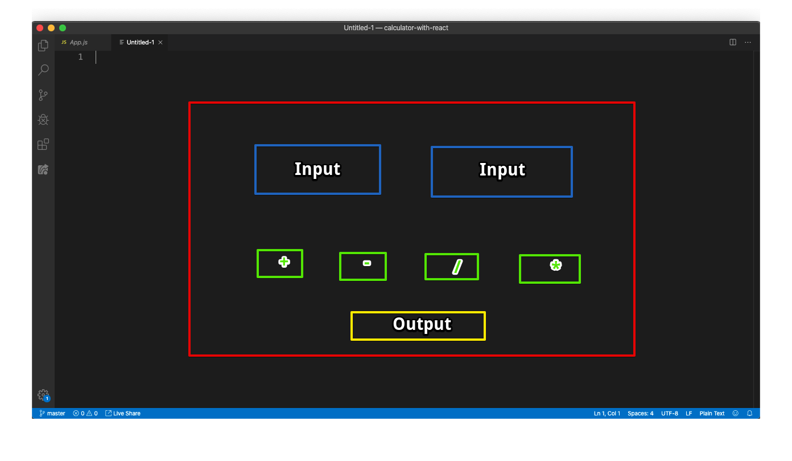
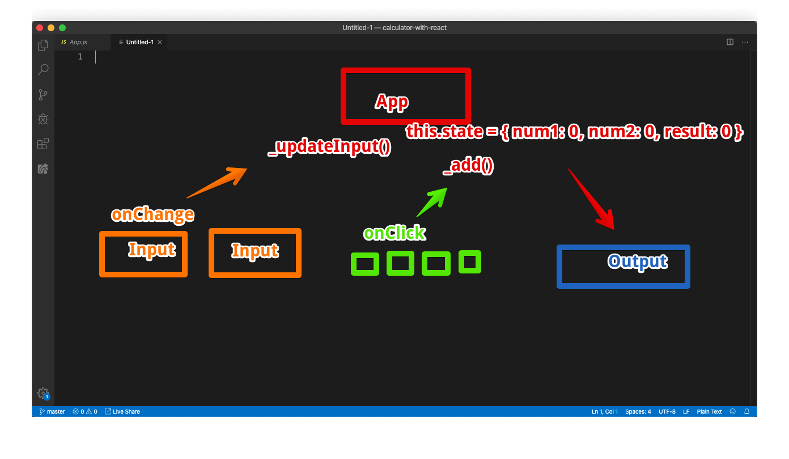

## Calculator built with React 

Features:
- Two number inputs 
- Four buttons for each arithmetic operations 
- An output that shows the result of doing te arithmetic operator on the two numbers 
- A reset button that clears the two inputs 

Diagram of Component Tree 

